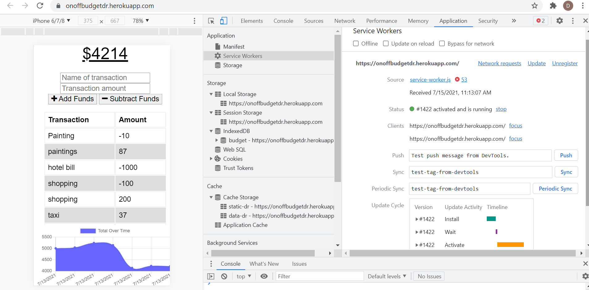
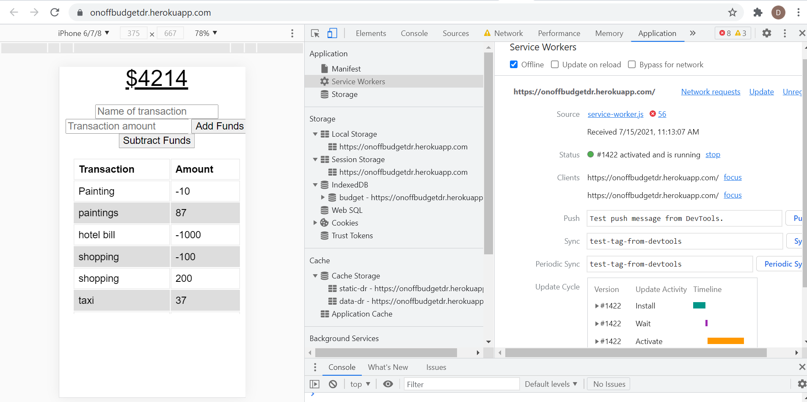

# Online/ Offline BudgetTracker_DR

## Table of Contents
* [Introduction](#introduction)
* [Dependencies and Tools used](#api)
* [App Presentation](#details)
* [Deployment](#installations)
* [Credits](#credits)
 
 ## Introduction 
For this application, the user can adding and/or subtracting his expenses and deposits to a given budgetsheet.It can be done both when you are online or offline. The concept of PWA's has been used _webmanifest_ file is helpful in working in the offline mode. For this application,I have used mongo DB and deployed the data to cloud using Mongo BD Atlas and is  finally deployed on Heroku._IndexDB_ in the application stores the budget which is further deployed in the heroku app.

   
 ## Dependencies and Tools used
   * In order to run the app, I installed the required dependencies using npm install.
   * The app can run through localhost or can be used through the heroku deployed URL
   * All the information is seeded in the mongoDB database 
   * The I connected the dataase to __Mongo DB Atlas__.Atlas handles all the complexity of deploying, managing, and healing your deployments on the AWS cloud service provider.
   *  Along with it,I deployed the app through __Heroku__ web host and Configured an additional add on  __MONGODB_URI__ in order to relate the code and database.

 
 ## App Presentation
 The web app created can be run either from the server using __localhost:3001__ or through the heroku link. You can also see how the online and offline versions of the same app may look like
   * ONLINE VIEW
   
   
    
   * OFFLINE VIEW

   
   

 ## Deployment
  The app has been deployed on GITHUB, where all the codes are visible, and the working web app has been deployed on heroku
   * [The URL of the Github repo](https://github.com/Dipti2021/BudgetTracker_DR)
   *  

  ## Credits
    The project has been assigned by the Carleton University Coding Bootcamp, our instructor and the TA's
